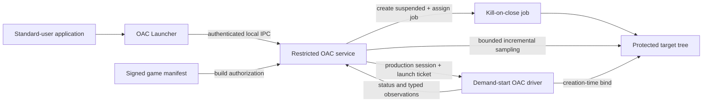

# OAC

[](https://github.com/lauralex/OAC/actions/workflows/msbuild.yml)
[](LICENSE)
[](#build-from-source)

**A defensive Windows anti-cheat research project with a demand-start kernel driver, a restricted
control service, and reproducible disposable-VM validation.**

OAC explores how to build a small, explicit trust boundary between a standard-user launcher, a
privileged Windows service, and a kernel driver. The current production-control MVP can authenticate
a local launcher request, authorize an exact signed game build, create it under the caller's token,
bind that process during creation, confirm the exact process handle, assign its process tree to a
service-owned job, and only then resume its first thread.

> [!IMPORTANT]
> OAC is an engineering reference, not a production-ready anti-cheat release. It does not yet include
> externally signed runtime policy, authenticated backend evidence delivery, backend leases,
> manifest-key rotation, a supported compatibility matrix, or production driver signing. Never
> install the disposable test package on a workstation or production system.

## Why this project exists

OAC focuses on security properties that are easy to lose in a Windows anti-cheat design:

- **Authority stays narrow.** Standard users communicate with a restricted service and never
  receive a privileged driver handle.
- **Target binding happens early.** A bounded, one-use launch ticket binds the target in the process
  creation callback before its initial thread is resumed.
- **Kernel work stays bounded.** Blocking inspection, signature checks, reporting, and stack walking
  remain in user mode; callbacks and processor sampling stay IRQL-appropriate.
- **Lifetime rules are explicit.** Sessions are bound to exact process and file objects, use rundown,
  and retain a live-target tombstone when cleanup cannot safely retire immediately.
- **Evidence loss is explicit.** Important alerts remain until acknowledged, lower-priority event
  gaps are counted, and large inventories use immutable bounded snapshots.
- **Claims are evidence-bound.** Driver-backed behavior is exercised in a networkless disposable VM
  under standard Driver Verifier, while broader compatibility remains explicitly unclaimed.

## Architecture at a glance



The launcher exposes status and one serialized executable-launch request. The service authenticates
the local client, resolves and keeps the executable open under that identity, verifies its adjacent
signed manifest and persistent rollback state, then arms the driver. It creates the process
suspended with the caller's primary token, confirms the exact process, assigns it to a kill-on-close
job, and resumes it. The driver enforces the session and target identity,
filters selected dangerous user-mode process and thread handles, and reports prior session loss to
the next restricted service instance. The service applies one typed rule catalog to both evidence
channels; the driver does not assign policy outcomes. A separate service worker incrementally
samples target memory regions and threads while the health loop continues to acknowledge alerts and
monitor liveness.

The separate `OAC-Client` scanner is a **lab-only diagnostic tool**. It is unavailable unless an
explicit `LabMode=1` test configuration is present, and it cannot become the production controller.

## What is implemented

### Production-control MVP

- Strict typed negotiate, claim, status, launch-arm, cancel, and target-confirm messages.
- Authority bound to the restricted service SID, creator process object, claimed file object,
  random session identifier, and monotonic generation.
- Standard-user status and one-executable launch through identity-checked local IPC.
- Suspended caller-token process creation with canonical-path matching and one-use ticket expiry.
- Canonical signed game manifests with exact executable hash, Authenticode signer, component
  compatibility, expiration, protected signer pinning, and per-game rollback prevention.
- Creation-time kernel binding, exact-handle confirmation, job assignment, and first-thread resume.
- Service-owned target-tree lifetime with kill-on-close containment on graceful stop or service
  failure, plus explicit idempotent driver-session revocation.
- A monotonic session-loss status latch for service recovery diagnostics.
- Separate bounded channels for retained high/critical alerts and lower-priority operational
  events, with explicit sequence, acknowledgement, and loss metadata.
- Frozen, expiring kernel-module snapshots with stable identifiers and cursor-based paging.
- A centralized typed rule catalog with Observe, Enforce, and Strict modes, explicit confidence and
  action results, signer-state classification, and display-text-independent decisions.
- A bounded service evidence path that evaluates both channels, retains actionable policy results,
  and fails closed on alert loss, session revocation, or local handoff exhaustion.
- An independent service health loop and one-slot, cancellation-aware target worker with fixed
  time, region, byte, and thread budgets, continuation state, and measured suspension latency.
- Per-file cleanup, rundown, protocol isolation, live-target tombstones, and safe retirement.
- Demand-start driver and service installation with strict package, service-policy, and cleanup
  verification in the disposable test workflow.

### Lab-only diagnostics

The diagnostic scanner includes process, module, driver, handle, device, hardware-identity,
debugger, virtualization, memory, thread, stack, service, callback, and kernel-integrity inspection.
It correlates independent observations and preserves uncertainty rather than presenting every
heuristic as proof of cheating.

See the [capabilities reference](docs/CAPABILITIES.md) for the complete matrix and its limitations.

### Still planned

- Externally signed runtime policy selection and manifest-key rotation/revocation metadata.
- Approved module, middleware, overlay, child-process, and runtime-class rules for real games.
- Authenticated backend sessions, leases, and evidence acknowledgement.
- Production signing, operational controls, privacy review, and supported-platform certification.

The [hardening roadmap](docs/hardening-plan.md) describes this remaining work. Roadmap text is not a
claim that a feature already exists.

## Repository layout

| Path | Responsibility |
|---|---|
| [`OAC/`](OAC/) | C17 WDM driver, session lifetime, callbacks, bounded scans, and telemetry |
| [`OAC-Service/`](OAC-Service/) | Restricted controller, target-launch owner, and bounded scan scheduler |
| [`OAC-Launcher/`](OAC-Launcher/) | Standard-user status and launch client |
| [`OAC-Client/`](OAC-Client/) | Elevated lab scanner and diagnostic reporting |
| [`shared/`](shared/) | Production, diagnostic, launcher IPC, manifest, and typed policy contracts |
| [`tests/unit/`](tests/unit/) | Driver-free protocol, policy, layout, validation, and transition tests |
| [`tools/`](tools/) | Protocol integration, packaging, policy, and repository tooling |
| [`tools/vm/`](tools/vm/) | Networkless Hyper-V and Driver Verifier acceptance harness |

## Build from source

Requirements:

- Visual Studio 2022 with the Desktop C++ workload
- Windows SDK and WDK `10.0.26100.0`
- An x64 Native Tools command prompt

```powershell
msbuild .\OAC.sln /m /t:Rebuild `
  /p:Configuration=Release /p:Platform=x64 `
  /p:PreferredToolArchitecture=x64 /p:Inf2CatUseLocalTime=true

.\x64\Release\OAC-Protocol-Unit.exe
```

The build intentionally produces an unsigned driver. Do not load it by weakening host security or
using a vulnerable-driver mapper. Use an authorized signing pipeline for production work, or follow
the [disposable-VM test guide](docs/test-signing.md) for isolated development validation.

For both supported configurations, repository validation, static analysis, and change-specific
gates, see [CONTRIBUTING.md](CONTRIBUTING.md).

## Launcher interface

After a reviewed deployment has installed the driver and restricted service, a standard user can
query the production-control path:

```powershell
OAC-Launcher.exe --status
```

The same user can request one absolute local executable path with no arguments:

```powershell
OAC-Launcher.exe --launch "C:\Games\Example\Game.exe"
```

This interface demonstrates the current MVP boundary. It is not a general-purpose launcher and
requires an adjacent authorized game manifest and detached signature. It does not provide backend
admission.

## Validation status

The current signed-manifest source passes clean local Debug/Release builds, `518/518` driver-free
tests in both configurations, repository validation, and driver PREfast. Its exact-commit
disposable-VM and Driver Verifier campaign is still pending.

Acceptance commit `5c476c246462c968d98185c6db159fdaf6a0238d` passed:

- clean x64 Debug and Release builds with warnings treated as errors;
- `477/477` driver-free protocol and policy tests in both configurations;
- driver PREfast and solution-wide Release analysis;
- package, catalog, signature, INF, seed, and host-residue validation; and
- a networkless Windows 11 build 26100 campaign with 30 exact results, standard Driver Verifier,
  verified job ownership, service-crash and graceful-stop process-tree containment, bounded typed
  evidence transport and snapshots, integrated policy evaluation, independent health-loop and
  target-scan measurements, and zero crashes or minidumps.

That campaign proves one exact source, build, configuration, and guest environment. It is not a
universal Windows, HVCI/VBS, hardware, or game-compatibility certification. Maintainer-facing
evidence and remaining gates live in the [development records](docs/development/README.md).

## Documentation

### For users and evaluators

- [Architecture](docs/ARCHITECTURE.md)
- [Security model](docs/SECURITY_MODEL.md)
- [Protocol reference](docs/PROTOCOL.md)
- [Capability matrix](docs/CAPABILITIES.md)
- [Driver-load research](docs/driver-load-review.md)
- [Hardware-identity research](docs/hwid-review.md)
- [Security policy](SECURITY.md)

### For contributors and maintainers

- [Contributing guide](CONTRIBUTING.md)
- [Development records](docs/development/README.md)
- [Disposable-VM test guide](docs/test-signing.md)
- [Documentation index](docs/README.md)

## Security and responsible use

OAC is defensive software. The project does not accept vulnerable-driver loading, kernel hiding,
Code Integrity or PatchGuard bypasses, anti-forensics, exploit delivery, or private-loader hooks.
Kernel-privileged attackers, DMA devices, hostile hypervisors, and compromised firmware remain
outside what an in-guest anti-cheat can reliably defeat.

Report vulnerabilities privately through [SECURITY.md](SECURITY.md).

## License

Licensed under the [Apache License 2.0](LICENSE).
