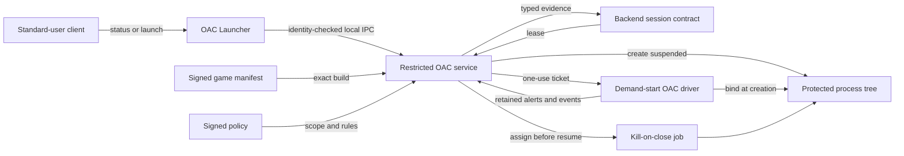

<div align="center">

# OAC

**A defensive Windows anti-cheat research platform with a narrow, auditable trust boundary.**

[](https://github.com/lauralex/OAC/actions/workflows/msbuild.yml)
[](LICENSE)
[](#building-oac)

Demand-start kernel protection · Restricted service authority · Reproducible isolated validation

</div>

OAC combines a Windows kernel driver, a restricted control service, and a standard-user launcher.
It explores how much useful protection can be achieved without turning the driver into a second
operating system: identity, signatures, policy, reporting, and blocking operations remain in user
mode, while the kernel retains only the responsibilities that genuinely require kernel authority.

> [!IMPORTANT]
> OAC is an engineering reference, **not a production-ready anti-cheat release**. The repository
> does not provide production driver signing, a supported hardware and Windows compatibility
> matrix, authenticated backend admission, or a finished game-integration SDK. Never install the
> disposable test package on a workstation or production system.

## How it works



A launch is deliberately serialized. The service authenticates the local client, locks and verifies
the requested executable, checks its signed manifest and the active signed policy, arms a bounded
driver ticket, creates the process suspended under the caller's token, confirms the exact process
handle, assigns the process tree to a service-owned job, and only then resumes the first thread.

## Security properties

- **Narrow authority.** Standard users never receive a privileged driver handle. Production driver
  access is bound to the restricted service identity, creator process object, exact file object,
  random session identifier, and monotonic generation.
- **Early process binding.** The driver matches a one-use ticket in the process-creation callback;
  it does not infer authority later from a reusable process identifier.
- **Authenticated inputs.** Canonical game manifests and policy records use detached signatures,
  protected signer pins, explicit scope and expiry, and persistent rollback state.
- **Deterministic lifetime.** The target tree belongs to an unnamed kill-on-close job. Service
  failure, graceful revocation, handle cleanup, and a live-target tombstone have explicit outcomes.
- **Bounded kernel work.** Callbacks and processor sampling remain allocation-conscious and
  IRQL-appropriate. Filesystem access, certificate validation, policy evaluation, and reporting
  stay in the service.
- **Evidence with provenance.** High-priority alerts are retained until acknowledged, operational
  event gaps are counted, inventories use immutable paged snapshots, and policy decisions consume
  typed fields rather than display strings.

## What is implemented

The current source includes:

- strict production negotiation, claim, status, launch-arm, cancel, confirmation, evidence-read,
  and snapshot messages;
- identity-checked launcher IPC and one serialized caller-token launch transaction;
- signed game-build authorization with exact executable hash and signer checks;
- signed rule policy with deployment mode, build and channel scope, bounded validity, component
  compatibility, replay protection, explicit rollback authorization, and emergency revocation;
- a transport-independent backend session with nonce replay rejection, bounded leases, monotonic
  evidence acknowledgement, a fixed service queue, and a test-only authenticated mock transport;
- creation-time target binding, exact-handle confirmation, pre-resume job assignment, and target
  process-tree containment;
- retained alerts, operational events, loss accounting, and frozen kernel-module snapshots;
- deterministic Observe, Enforce, and Strict policy evaluation with typed confidence and actions;
- a cancellation-aware service worker for bounded memory-region and thread sampling; and
- a fail-closed disposable-VM installer, package validator, protocol suite, and Driver Verifier
  campaign.

The separate **OAC Client** is an elevated laboratory scanner. It covers process, module, driver,
handle, memory, thread, stack, service, callback, hardware-identity, debugger, virtualization, and
kernel-integrity observations. It is unavailable unless the disposable test environment explicitly
enables diagnostic mode, and it cannot become the production controller.

See the [capability reference](docs/CAPABILITIES.md) for the complete matrix and the limitations of
each observation.

## Deliberate limitations

OAC does not claim universal detection, a driver-load veto, or protection against a hostile kernel,
DMA device, hypervisor, or compromised firmware. Work still required for a deployable product
includes:

- a production authenticated network transport, backend admission service, and durable remote
  evidence storage—the repository currently provides the strict transport contract and test mock;
- manifest signer rotation and revocation metadata;
- approved module, middleware, overlay, child-process, and runtime rules for a real game;
- production signing, release engineering, privacy and retention policy, and platform certification.

The [hardening plan](docs/hardening-plan.md) describes those work packages. Roadmap text is a design
target, not evidence that a feature already exists.

## Repository guide

| Path | Responsibility |
|---|---|
| [`OAC/`](OAC/) | C17 WDM driver: sessions, callbacks, bounded scans, and telemetry |
| [`OAC-Service/`](OAC-Service/) | Restricted controller, signed authorization, launch ownership, and scheduling |
| [`OAC-Launcher/`](OAC-Launcher/) | Standard-user status and launch client |
| [`OAC-Client/`](OAC-Client/) | Elevated laboratory scanner and diagnostic reports |
| [`shared/`](shared/) | Wire contracts, canonical records, policy rules, and strict validators |
| [`tests/unit/`](tests/unit/) | Driver-free layout, validation, transition, and policy regression tests |
| [`tools/`](tools/) | Integration tests, packaging, installation, and repository checks |
| [`tools/vm/`](tools/vm/) | Networkless Hyper-V and Driver Verifier acceptance workflow |

For architecture and security details, start with:

- [Architecture](docs/ARCHITECTURE.md)
- [Security model](docs/SECURITY_MODEL.md)
- [Production protocol](docs/PROTOCOL.md)
- [Capabilities and limitations](docs/CAPABILITIES.md)

Exact campaign hashes, work-package bookkeeping, historical baselines, and maintainer decisions are
kept separately in the [development records](docs/development/README.md).

## Building OAC

You need Visual Studio 2022, the x64 C++ toolchain, and Windows SDK/WDK `10.0.26100.0`.

```powershell
msbuild .\OAC.sln /m /t:Rebuild `
  /p:Configuration=Release /p:Platform=x64 `
  /p:PreferredToolArchitecture=x64 /p:Inf2CatUseLocalTime=true

.\x64\Release\OAC-Protocol-Unit.exe
```

The build intentionally produces an unsigned driver. **Do not weaken a development workstation to
load it and do not use a vulnerable-driver mapper.** Use an authorized production signing pipeline,
or follow the [disposable-VM guide](docs/test-signing.md) for isolated development testing.

The full contributor build, analysis, and change-specific gates are documented in
[CONTRIBUTING.md](CONTRIBUTING.md).

## Launcher interface

Inside the isolated test deployment, a standard user can query status or request one exact
executable launch:

```powershell
OAC-Launcher.exe --status
OAC-Launcher.exe --launch "C:\Games\Example\Game.exe"
```

The launch request accepts one absolute local executable path and no arguments. It requires an
authorized adjacent game manifest, a matching active policy, and a healthy backend lease. It is not
a general-purpose launcher. The included backend is a deterministic test double, not a production
admission service.

## Validation

The current accepted implementation has passed clean Debug and Release builds, driver-free
regression tests, PREfast, solution-wide static analysis, package and signing checks, and a
networkless Windows 11 build 26100 campaign under standard Driver Verifier. Runtime claims are
limited to the exact commit and environment recorded in the [test matrix](docs/TEST_MATRIX.md); they
are not a general Windows, HVCI/VBS, hardware, or game-compatibility certification.

## Responsible use

OAC is defensive software. The project does not accept vulnerable-driver loading, kernel hiding,
Code Integrity or PatchGuard bypasses, exploit delivery, anti-forensics, or private loader hooks.
Please report vulnerabilities privately through [SECURITY.md](SECURITY.md).

## License

Licensed under the [Apache License 2.0](LICENSE).
