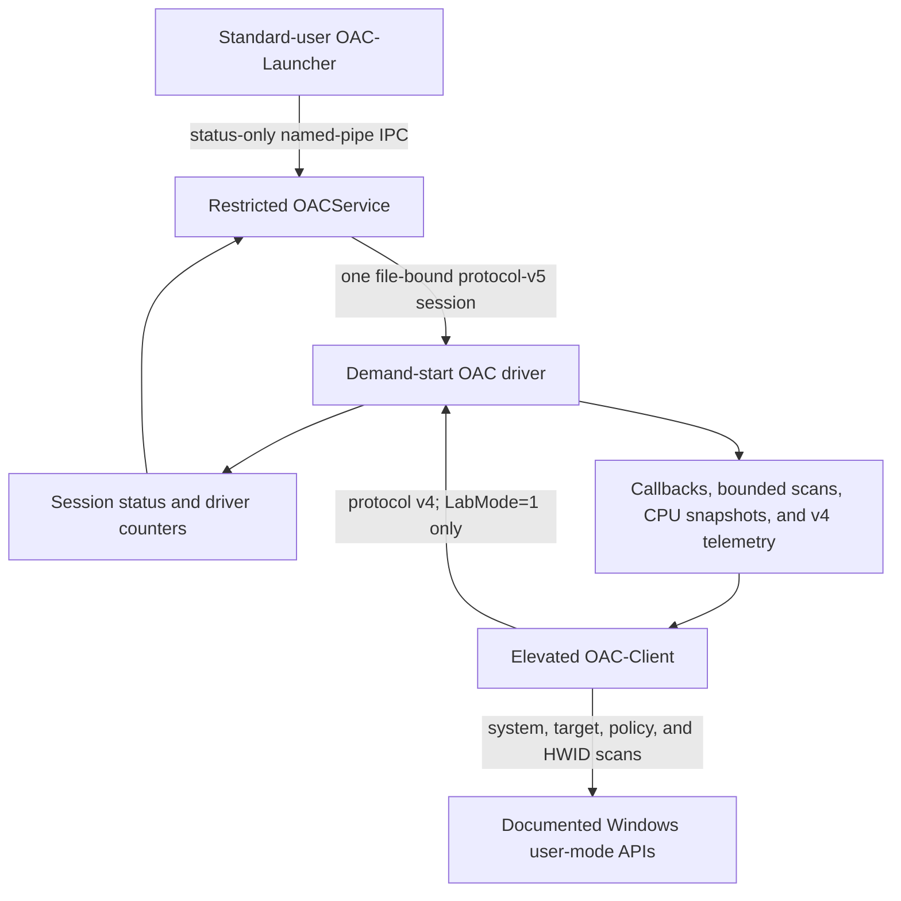

# OAC architecture

**Status:** WP-01 through WP-03 production-control foundation implemented in source; current
disposable-VM acceptance pending

**Frozen baseline:** `075ad2109f84cce90727f8ba65f87b807500e6b7`

## Current control paths

The production path currently establishes and reports control-plane health. It does not launch or
bind a game. The diagnostic path retains the earlier scanner and suspended/attach flows only for
explicit disposable-VM lab use.

## Components

| Component | Current responsibility | Boundary |
|---|---|---|
| `OAC` driver | Device security, v5 file sessions, callbacks, bounded kernel work, and v4 lab compatibility | Unsigned by default; demand-start only |
| `OACService` | Verify its restricted service identity, keep one v5 driver handle, claim production authority, and answer local status requests | LocalSystem own-process service with restricted service SID and minimal declared privilege |
| `OAC-Launcher` | Request hello/status without a driver handle and validate that the pipe server is the running SCM service in session 0 | Standard interactive user |
| `OAC-Client` | Legacy system/target scanning, policy evaluation, HWID collection, and local reports | Elevated, `LabMode=1`, audit/test only |
| `shared/protocol/` | Protocol-v5 types, stable IDs, layouts, and strict validators | Kernel and user mode |
| `shared/oac_ipc.h` | Fixed launcher/service status messages | Local named pipe |
| `shared/oac_protocol.h` | Protocol-v4 scanner ABI | Lab compatibility only |
| Protocol tests | Driver-free schema tests and driver-backed malformed/lifecycle/race tests | Host-safe unit or disposable VM as appropriate |

## Production service boundary

The disposable-VM installer configures the test instance of `OACService` as a manual own-process
LocalSystem service dependent on the manual OAC driver. It assigns the restricted per-service SID,
declares only `SeChangeNotifyPrivilege`, sets the service owner and group to SYSTEM, explicitly
grants Administrators and Interactive only query-status and start access, protects the installed
binaries, and keeps the service stopped until a test explicitly starts the production-control
phase. Production deployment tooling must reproduce and verify this policy.

At startup, the service fails closed unless its primary token is session 0, restricted, and contains
the exact reviewed service SID in both enabled groups and restricted SIDs. It opens the driver,
negotiates exact v5, claims a production session, validates a correlated status response, then keeps
that driver handle for its lifetime.

The local message-mode pipe rejects remote clients and does not grant clients pipe-instance
creation. Before returning status, the service impersonates at identification level and verifies an
interactive, medium-or-higher, non-AppContainer local client. It cross-checks the pipe-reported PID
and session with a live process handle, user SID, and authentication LUID. The launcher separately
checks that the pipe server PID is the running `OACService` SCM process in session 0. These are local
identity and authorization checks, not cryptographic backend authentication.

Only hello and status IPC messages exist. There is no launch request, policy transfer, manifest,
evidence upload, or backend lease.

## Per-file driver session

The driver creates a context for each device file and references the CREATE-owner process. In
production mode, device create and claim require the exact restricted service identity. Successful
claim generates a random nonzero 128-bit session ID and a monotonic nonzero generation and binds
authority to all of these values:

- the service SID and current service process object;
- the CREATE-owner process object;
- the exact file object and its context;
- the session ID, generation, mode, and active state.

A second file can negotiate but cannot claim while the active session exists, and copied session
credentials do not confer authority. A duplicated file handle used from another process also fails
because authorization compares referenced process objects, not numeric PIDs.

Accepted requests acquire `EX_RUNDOWN_REF` protection. Cleanup runs once, prevents new acquisition,
marks the session closing, waits for in-flight requests, and releases the controller references.
Close releases the file-context reference. Driver shutdown marks the session closing and releases
all held objects.

### Live-target tombstone

A cleaned session with no target retires immediately. If a referenced target is still live, the
cleaned session remains the device's active but unusable tombstone. No new session can be claimed
until the process-exit callback clears the target reference and retires that tombstone. This avoids
transferring control while stale protection state survives the original handle.

The tombstone invariant is implemented and also applies to a target bound through the v4 lab path.
The production path cannot create this state yet because creation-time launch tickets and target
binding are WP-04 work. Target-live tombstone validation in a disposable VM therefore remains
pending.

## Protocol and evidence boundary

Production v5 currently dispatches negotiate, claim, and status and advertises session control only.
The shared ABI defines stable rule/event IDs and a provenance-preserving event record, and the pure
unit suite validates that schema. The driver does not yet expose v5 configuration, scanning, event
read, CPU snapshot, or revoke operations. Existing findings still travel through the v4 lab ring.

## Planned sequence

1. Add one-time launch tickets and creation-time target binding.
2. Assign the suspended target tree to a service-owned kill-on-close job and finish liveness rules.
3. Separate critical alerts, operational events, and paged snapshots.
4. Keep health and evidence acknowledgement independent of expensive scan workers.
5. Centralize typed policy, then add signed manifests, signed policy, and backend leases.

The complete target and migration rationale is in [`hardening-plan.md`](hardening-plan.md).

## Compatibility boundary

Portable checks use documented interfaces and dynamically resolved optional APIs. Unsupported APIs
produce an explicit unavailable or degraded capability. Private offsets are never guessed. The x64
implementation does not establish x86, ARM64, or historical Windows support, and no current v5 VM
result has yet established compatibility beyond successful host compilation and pure validation.
