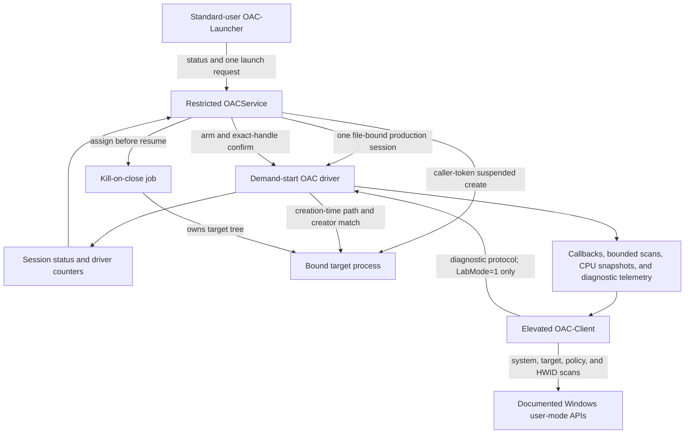

# OAC architecture

**Status:** WP-01 through WP-05 accepted on the named Windows 11 build 26100 campaign

**Frozen baseline:** `075ad2109f84cce90727f8ba65f87b807500e6b7`

## Current control paths

The production path establishes control-plane health and launches one authenticated caller-owned
executable through a serialized creation-time binding transaction. The diagnostic path retains the
earlier scanner and suspended/attach flows only for explicit disposable-VM lab use.

## Components

| Component | Current responsibility | Boundary |
|---|---|---|
| `OAC` driver | Device security, production file sessions, callbacks, bounded kernel work, and diagnostic compatibility | Unsigned by default; demand-start only |
| `OACService` | Verify its restricted identity, own the production driver session and target job, answer status, and serialize one caller-token suspended launch | LocalSystem own-process service with restricted service SID and an exact declared privilege list |
| `OAC-Launcher` | Request hello/status or one executable launch without a driver handle and validate the running SCM pipe server | Standard interactive user |
| `OAC-Client` | Legacy system/target scanning, policy evaluation, HWID collection, and local reports | Elevated, `LabMode=1`, audit/test only |
| `shared/protocol/` | Production protocol types, stable IDs, layouts, and strict validators | Kernel and user mode |
| `shared/oac_ipc.h` | Fixed launcher/service status and launch messages | Local named pipe |
| `shared/oac_protocol.h` | Diagnostic scanner ABI | Lab compatibility only |
| Protocol tests | Driver-free schema tests and driver-backed malformed/lifecycle/race tests | Host-safe unit or disposable VM as appropriate |

## Production service boundary

The disposable-VM installer configures the test instance of `OACService` as a manual own-process
LocalSystem service dependent on the manual OAC driver. It assigns the restricted per-service SID,
declares only `SeAssignPrimaryTokenPrivilege`, `SeChangeNotifyPrivilege`, `SeImpersonatePrivilege`,
and `SeIncreaseQuotaPrivilege`, sets the service owner and group to SYSTEM, explicitly
grants Administrators and Interactive only query-status and start access, protects the installed
binaries, and keeps the service stopped until a test explicitly starts the production-control
phase. Production deployment tooling must reproduce and verify this policy.

At startup, the service fails closed unless its primary token is session 0, restricted, and contains
the exact reviewed service SID in both enabled groups and restricted SIDs. It opens the driver,
negotiates the exact production revision, claims a production session, validates a correlated status response, then keeps
that driver handle for its lifetime.

The local message-mode pipe rejects remote clients and does not grant clients pipe-instance
creation. Before returning status or accepting a launch, the service impersonates at impersonation
level and verifies an interactive, medium-or-higher, non-AppContainer local client. It cross-checks
the pipe-reported PID and session with a live process handle, user SID, and authentication LUID, then
duplicates that exact identity to a primary token for launch. The launcher separately checks that
the pipe server PID is the running `OACService` SCM process in session 0. These are local identity
and authorization checks, not cryptographic backend authentication.

The IPC surface contains hello, status, and one absolute executable launch request. The service
opens and resolves the executable under client impersonation, keeps the file locked against writes
and deletion, arms a bounded kernel ticket for the exact volume-device and DOS-device path spellings,
creates the process suspended under the client's primary token, confirms the exact process handle,
validates monitoring state, assigns the process to a service-owned kill-on-close job, and resumes
the initial thread. Child processes inherit that job. Graceful stop explicitly revokes the driver
session before closing the job; unexpected service exit closes both driver and job handles through
normal Windows handle teardown. There is no argument transport, policy transfer, signed manifest,
evidence upload, authenticated backend lease, or service-session reuse after the target exits.

## Per-file driver session

The driver creates a context for each device file and references the CREATE-owner process. In
production mode, device create and claim require the exact restricted service identity. Successful
claim generates a random nonzero 128-bit session ID and a monotonic nonzero generation and binds
authority to all of these values:

- the service SID and current service process object;
- the CREATE-owner process object;
- the exact file object and its context;
- the session ID, generation, mode, and active state.

A second file can negotiate but cannot claim while the active session exists, and copied session
credentials do not confer authority. A duplicated file handle used from another process also fails
because authorization compares referenced process objects, not numeric PIDs.

Accepted requests acquire `EX_RUNDOWN_REF` protection. Cleanup runs once, prevents new acquisition,
marks the session closing, waits for in-flight requests, and releases the controller references.
Close releases the file-context reference. Driver shutdown marks the session closing and releases
all held objects.

An explicit revoke request is idempotent and records requested-shutdown provenance. If cleanup or
service exit wins instead, the first observed cause is recorded. The driver exposes a monotonic
device-lifetime sequence and last-cause pair through status; the next restricted service relays it
to the standard-user launcher. This is a narrow liveness latch, not the later alert/event channel.

### Live-target tombstone

A cleaned session with no target retires immediately. If a referenced target is still live, the
cleaned session remains the device's active but unusable tombstone. No new session can be claimed
until the process-exit callback clears the target reference and retires that tombstone. This avoids
transferring control while stale protection state survives the original handle.

The tombstone invariant applies to both diagnostic binding and the one-use production launch ticket.
The service drives the serialized production transaction; implementation commit
`a30ef78819b865786f6f4e104b7a54f48678da7f` passed the driver-backed target-live, cleanup,
standard-user launch, job-owned child, service-crash recovery, graceful revoke, and session-loss
cases under the baseline and Driver Verifier phases.

## Protocol and evidence boundary

Production control dispatches negotiate, claim, status, explicit revoke, arm, cancel, and confirm
while advertising session control, launch-ticket, and session-liveness support.
The shared ABI defines stable rule/event IDs and a provenance-preserving event record, and the pure
unit suite validates that schema. The driver does not yet expose production configuration, scanning,
event read, or CPU snapshot operations. Existing findings still travel through the diagnostic ring.

## Planned sequence

1. Separate critical alerts, operational events, and paged snapshots.
2. Keep health and evidence acknowledgement independent of expensive scan workers.
3. Centralize typed policy, then add stable executable identity, signed manifests, signed policy,
   and backend leases.

The complete target and migration rationale is in [`hardening-plan.md`](hardening-plan.md).

## Compatibility boundary

Portable checks use documented interfaces and dynamically resolved optional APIs. Unsupported APIs
produce an explicit unavailable or degraded capability. Private offsets are never guessed. The x64
implementation passed one exact Windows 11 Pro build 26100 VM configuration; it does not establish
x86, ARM64, historical Windows, other security configurations, hardware, or game compatibility.
