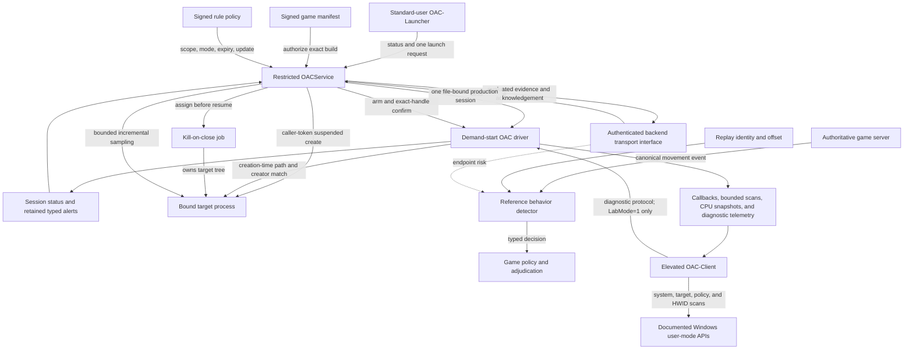

# OAC architecture

**Status:** WP-01 through WP-12 accepted locally and in the disposable-VM campaign at implementation
commit `67d3f616cdb13f1ac10877d067da1b54cca5e51c` on Windows 11 build 26100. PR #18 hosted checks also
passed. WP-13's portable game-event contract and reference server detector passed local and PR #19
hosted driver-free acceptance at `8eca1747680f7dc9ad084d1e1897f30bfec08d83`; production game and
backend deployment remain external integration work. The current WP-14 source adds an exact
unsigned candidate, source-bound build metadata, SPDX inventory, and private-symbol separation;
production certification and signing remain external promotion gates.

**Frozen baseline:** `075ad2109f84cce90727f8ba65f87b807500e6b7`

## Current control paths

The production path establishes control-plane health and launches one authenticated caller-owned
executable through a serialized creation-time binding transaction. The diagnostic path retains the
earlier scanner and suspended/attach flows only for explicit disposable-VM lab use.

## Components

| Component | Current responsibility | Boundary |
|---|---|---|
| `OAC` driver | Device security, production file sessions, callbacks, retained alerts, operational events, paged snapshots, bounded kernel work, and diagnostic compatibility; scanner internals are separated into integrity, module, and process/handle responsibilities | Unsigned by default; demand-start only |
| `OACService` | Verify its restricted identity, signed policy, signed game build, persistent update state, and backend lease; own the production driver session and target job; evaluate and queue typed evidence; answer status; serialize one caller-token suspended launch; and schedule bounded target sampling | LocalSystem own-process service with restricted service SID and an exact declared privilege list |
| `OAC-Launcher` | Request hello/status or one executable launch without a driver handle and validate the running SCM pipe server | Standard interactive user |
| `OAC-Client` | Laboratory system/target scanning, policy evaluation, HWID collection, and local reports | Elevated, `LabMode=1`, audit/test only |
| `shared/protocol/` | Production protocol types, stable IDs, layouts, and strict validators | Kernel and user mode |
| `shared/oac_policy.*` | Stable rule identities, deployment modes, signer classification, and deterministic policy evaluation | C-compatible service and driver-free test module |
| `shared/oac_signed_policy.*` | Canonical policy record, strict validation, scope, update decisions, and persistent high-water state | C-compatible service and driver-free test module; detached signature verification remains in user mode |
| `shared/oac_manifest.*` | Canonical manifest and rollback records, strict validation, exact build identity, and monotonic high-water decisions | C-compatible service and driver-free test module; signature verification remains in user mode |
| `shared/oac_backend.*` | Canonical backend-session records, strict correlation and replay validation, acknowledgement decisions, and bounded failure states | Transport-independent C contract; no network library or reusable client secret |
| `shared/oac_game.*` | Canonical authoritative movement records, replay-safe detector state, bounded rules, and explainable risk decisions | Portable C game/server contract; no network transport, game-engine dependency, or account identifier |
| `OAC-Service/backend.*` | Fixed-capacity service queue, lease lifecycle, driver binding digest, transport interface, and deterministic test backend | The included implementation is a protected test double; production transport remains a deployment component |
| `shared/oac_ipc.h` | Fixed launcher/service status and launch messages | Local named pipe |
| `shared/oac_protocol.h` | Diagnostic scanner ABI | Lab compatibility only |
| `shared/oac_windows.hpp` | Move-only Win32/SCM/registry ownership and small text or optional-API helpers shared by user-mode components | User mode only; no protocol or policy semantics |
| Protocol tests | Driver-free schema tests and driver-backed malformed/lifecycle/race tests | Host-safe unit or disposable VM as appropriate |
| Release profile and candidate tools | Bind versions and compatibility to source; create exact public, private-symbol, and lab bundles; emit manifests, SPDX SBOM, and checksums; reject hostile mutations | Unsigned build boundary only; production signing and publication are separate controlled operations |

## Scanner organization

The refactored scanner keeps one public kernel interface while separating implementation details by
the Windows data they own:

| Source | Responsibility |
|---|---|
| `OAC/scanner.c` | Lifecycle, top-level orchestration, CPU and kernel integrity, debugger, hypervisor, and build-gated private observations |
| `OAC/scanner_modules.c` | AuxKlib and system-module cross-views, driver-family classification, and immutable kernel-module snapshots |
| `OAC/scanner_process.c` | Process/thread and system-handle cross-views, target-handle inspection, and physical-memory handle detection |
| `OAC-Client/client_options.*` | Pure parsing and validation of diagnostic-client options, independently exercised by the driver-free unit suite |

This is an internal responsibility split, not a new detection claim. The diagnostic ABI, finding
categories, scan ordering, and report contract remain unchanged.

## Game and server boundary

`shared/oac_game.*` is intentionally independent of the driver, service, and Windows APIs. An
authenticated game server creates canonical records from its own authoritative state. Each record
is scoped to one game, build, backend session, match, player pseudonym, replay digest, monotonic
sequence, server tick, and replay offset. The schema carries no raw account identifier and makes no
claim that an unauthenticated caller becomes authoritative by setting a flag.

The reference detector stores one bounded state record per complete identity tuple. It rejects
replayed, reordered, malformed, or foreign-scope input without mutation; reports forward sequence
and tick gaps; and checks authoritative X/Y and Z displacement against tick-scaled speed and
tolerance limits. Reported velocity is checked independently. A server correction bypasses only
the position envelope. Typed behavior risk and separately supplied endpoint risk remain visible in
the result and combine through saturated, policy-selected thresholds. Endpoint-only risk remains
observational; server-side behavior risk is required for Review or Reject.

This implements the portable interface, event schema, replay state, and one server-side invariant
required by WP-13. It is a reference integration boundary, not a deployed backend. Authentication,
durable partitioned state, replay storage, game-engine adaptation, ruleset signing, additional
gameplay detectors, and adjudication remain production responsibilities described in
[`GAME_INTEGRATION.md`](GAME_INTEGRATION.md).

## Production service boundary

The disposable-VM installer configures the test instance of `OACService` as a manual own-process
LocalSystem service dependent on the manual OAC driver. It assigns the restricted per-service SID,
declares only `SeAssignPrimaryTokenPrivilege`, `SeChangeNotifyPrivilege`, `SeImpersonatePrivilege`,
and `SeIncreaseQuotaPrivilege`, sets the service owner and group to SYSTEM, explicitly
grants Administrators and Interactive only query-status and start access, protects the installed
binaries, and keeps the service stopped until a test explicitly starts the production-control
phase. Production deployment tooling must reproduce and verify this policy.

At startup, the service fails closed unless its primary token is session 0, restricted, and contains
the exact reviewed service SID in both enabled groups and restricted SIDs. It verifies the local
canonical policy and detached signature through non-reparse handles, requires the protected signer
pin, validates component compatibility and expiry, and flushes and rereads the scoped update state.
Replay, same-sequence equivocation, unauthorized rollback, and emergency revocation are terminal.
It next establishes an authenticated backend session, derives a binding digest from the session
and both nonces, and starts its bounded lease before opening the driver. It then
negotiates the exact production revision and evidence bounds, claims a production session,
validates a correlated status response, then keeps that driver handle for its lifetime. While
waiting for stop, failure, or target exit, it polls retained alerts and lower-priority events on a
bounded interval. It fails closed on retained-alert loss, backend lease loss or revocation,
malformed correlation, evidence-queue exhaustion, or acknowledgement timeout. An orderly stop or
target transition performs one final bounded evidence drain before the session is revoked.

Every current driver producer emits a typed observation with policy severity set to
`NOT_EVALUATED`. The service validates the stable rule ID, event type, category, observation range,
and required provenance against the authenticated policy's canonical rule set, then evaluates it in
the signed Observe, Enforce, or Strict mode. Every evaluated record enters one fixed-capacity
backend queue. Retained-alert acknowledgement advances in the driver only after the backend has
acknowledged the corresponding service sequence. The service supports a deny-launch latch for
policy decisions; game-manifest and policy-scope rejection also occur directly at the
launch-authorization boundary.
Revoke-session terminates the service runtime so normal
cleanup revokes the driver session and closes the target job. Display payload text is validated as
transport data but never read by the policy evaluator.

After a target is confirmed, job-owned, and resumed, the service starts one worker with a single
coalescing work slot. The health loop continues independently at a 250 ms cadence and queues scan
slices without waiting for them. Each slice carries a 20 ms admission deadline, a 64-region and
64 KiB memory budget, and a one-thread round-robin budget; one in-flight Windows operation may
finish after the admission deadline. Memory traversal retains a continuation cursor and
samples executable non-image regions. Thread sampling opens the target thread under the already
authenticated target-owner identity, immediately reverts to the restricted service identity,
captures bounded context metadata, and resumes through a shared RAII guard. Stop, target exit, and
service failure cancel the worker before target authority handles are released. Status reports
coverage, CPU and wall time, queue outcomes, health latency, peak working storage, and the longest
observed thread suspension. These remain collection and health metrics; the central policy catalog
consumes typed driver observations rather than scanner display strings.

The local message-mode pipe rejects remote clients and does not grant clients pipe-instance
creation. Before returning status or accepting a launch, the service impersonates at impersonation
level and verifies an interactive, medium-or-higher, non-AppContainer local client. It cross-checks
the pipe-reported PID and session with a live process handle, user SID, and authentication LUID, then
duplicates that exact identity to a primary token for launch. The launcher separately checks that
the pipe server PID is the running `OACService` SCM process in session 0. These are local identity
and authorization checks, not cryptographic backend authentication.

The IPC surface contains hello, status, and one absolute executable launch request. The service
opens and resolves the executable under client impersonation and keeps the file locked against
writes and deletion. Before arming the driver it reads the adjacent fixed-size manifest and detached
CMS signature through non-reparse handles, validates the executable's Windows trust and exact
signer, requires the signer certificate SHA-256 provisioned in a protected registry value, checks
the executable leaf name, size, and SHA-256, enforces component compatibility and expiration, and
updates protected per-game high-water state. It then arms a bounded kernel ticket for the exact
volume-device and DOS-device path spellings plus the verified manifest digest,
creates the process suspended under the client's primary token, confirms the exact process handle,
validates monitoring state, assigns the process to a service-owned kill-on-close job, and resumes
the initial thread. Child processes inherit that job. Graceful stop explicitly revokes the driver
session before closing the job; unexpected service exit closes both driver and job handles through
normal Windows handle teardown. There is no argument transport, remote policy delivery, production
network transport, durable remote evidence store, manifest-key rotation, or service-session reuse
after the target exits.

## Per-file driver session

The driver creates a context for each device file and references the CREATE-owner process. In
production mode, device create and claim require the exact restricted service identity. Successful
claim generates a random nonzero 128-bit session ID and a monotonic nonzero generation and binds
authority to all of these values:

- the service SID and current service process object;
- the CREATE-owner process object;
- the exact file object and its context;
- the session ID, generation, mode, and active state.

A second file can negotiate but cannot claim while the active session exists, and copied session
credentials do not confer authority. A duplicated file handle used from another process also fails
because authorization compares referenced process objects, not numeric PIDs.

Accepted requests acquire `EX_RUNDOWN_REF` protection. Cleanup runs once, prevents new acquisition,
marks the session closing, waits for in-flight requests, and releases the controller references.
Close releases the file-context reference. Driver shutdown marks the session closing and releases
all held objects.

An explicit revoke request is idempotent and records requested-shutdown provenance. If cleanup or
service exit wins instead, the first observed cause is recorded. The driver exposes a monotonic
device-lifetime sequence and last-cause pair through status; the next restricted service relays it
to the standard-user launcher. This narrow liveness latch remains independent of the typed evidence
queues because it survives the controller that would otherwise read them.

### Live-target tombstone

A cleaned session with no target retires immediately. If a referenced target is still live, the
cleaned session remains the device's active but unusable tombstone. No new session can be claimed
until the process-exit callback clears the target reference and retires that tombstone. This avoids
transferring control while stale protection state survives the original handle.

The tombstone invariant applies to both diagnostic binding and the one-use production launch ticket.
The service drives the serialized production transaction; implementation commit
`67d3f616cdb13f1ac10877d067da1b54cca5e51c` passed the driver-backed target-live, cleanup,
standard-user launch, job-owned child, service-crash recovery, graceful revoke, and session-loss
cases under the baseline and Driver Verifier phases.

## Protocol and evidence boundary

Production control dispatches negotiate, claim, status, explicit revoke, arm, cancel, confirm,
evidence read, and snapshot management while advertising session control, launch-ticket,
session-liveness, typed-evidence, and paged-snapshot support. The driver routes high/critical
records into a retained acknowledgement queue and lower-priority records into an independent
overwrite queue with explicit gaps. One frozen, expiring kernel-module snapshot is read by stable
identifier and cursor. Existing display-oriented findings continue through the separate diagnostic
ring; production driver configuration and scan dispatch remain unavailable, while the service
worker uses documented user-mode process APIs. The driver never promotes its own observations to
policy violations. The service evaluates records received from both queues, preserves source
confidence and provenance, and keeps the separate policy decision with any actionable local copy.
Status also carries the verified manifest SHA-256 from launch arm through the terminal session so
service-side authorization remains correlated with driver target state. The kernel neither opens
files nor parses certificates or manifests.
Overwrite gaps remain explicit. The service now exposes evaluated records through the strict
backend transport interface and advances acknowledgement only after correlated backend delivery;
the included transport is an in-process authenticated test double rather than durable remote
persistence. The retained-alert, event-gap, overflow, concurrent-publication, and snapshot-paging
paths and the backend replay, acknowledgement-loss, lease-loss, and recovery boundaries passed the
named baseline and Driver Verifier campaign.

## Release boundary

The release workflow deliberately produces three disjoint trees: the public production-component
candidate, private full symbols, and isolated lab tools. A checked-in profile binds the release and
driver versions, compatibility revisions, SDK, and exact artifact names to source. The public
manifest and SPDX document are reconstructed from current build inputs; CI tests the boundary with
payload, metadata, symbol, allowlist, and lab-marker mutations. Release binaries embed only the PDB
leaf name, and public CI never uploads the private symbol tree.

This boundary does not confer trust. Microsoft driver certification, protected user-mode signing,
final signed-artifact manifests, compatibility admission, and staged publication happen in a
separate controlled environment described in [`RELEASE.md`](RELEASE.md).

## Planned sequence

1. Implement production authenticated transport, durable backend and replay persistence, and a real
   game-engine adapter behind the existing contracts.
2. Add signed manifest-key rotation metadata and a production updater that implements the reviewed
   release and rollback contract.
3. Add game-specific combat, economy, input, and protocol detectors and validate them against
   representative workloads and the supported-platform matrix.

The complete target and migration rationale is in [`hardening-plan.md`](hardening-plan.md).

## Compatibility boundary

Portable checks use documented interfaces and dynamically resolved optional APIs. Unsupported APIs
produce an explicit unavailable or degraded capability. Private offsets are never guessed. The x64
implementation passed one exact Windows 11 Pro build 26100 VM configuration; it does not establish
x86, ARM64, historical Windows, other security configurations, hardware, or game compatibility.
[`SUPPORT.md`](SUPPORT.md) is the public compatibility boundary.
