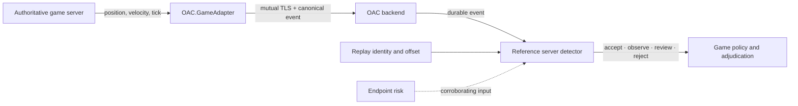

# Game and server integration

OAC separates authoritative gameplay telemetry from the Windows endpoint. The portable C contract
defines the canonical event and detector semantics; the .NET game adapter submits those records to
the separate admission backend. The game server owns gameplay truth, while endpoint evidence is
one independently retained input to a broader risk decision.

The implementation lives in [`shared/oac_game.h`](../shared/oac_game.h) and
[`shared/oac_game.c`](../shared/oac_game.c). It provides canonical records, strict validation,
replay-safe detector state, and one deterministic movement detector. It does **not** provide a
network transport or game-engine plug-in. [`OAC-backend/game-adapter`](../OAC-backend/game-adapter/)
provides the typed transport client, and [`OAC-backend`](../OAC-backend/) provides authenticated
ingestion and durable state. Account policy, game-engine binding, and production adjudication remain
the integrating platform's responsibility.

## Integration boundary



Only an authenticated server-side component should set the server-authority flag. The flag records
provenance inside the canonical event; it is not a signature and does not authenticate an
untrusted transport by itself.

The production adapter requires a current strong client-authentication certificate and the exact
backend server-certificate pin. The backend uses a game-server role that is disjoint from endpoint
controller certificates. One optional pin per side supports a bounded certificate rotation window.

## Canonical event

Each movement event has an exact 256-byte C-compatible layout. It binds the observation to:

| Field | Purpose |
|---|---|
| Game and build identities | Select the exact ruleset and executable generation |
| Backend session | Prevent one admitted session from borrowing another session's telemetry |
| Match identity | Isolate concurrent or restarted matches |
| Player pseudonym | Correlate play without carrying a raw account identifier |
| Replay SHA-256 and offset | Bind the event to durable replay material and its monotonic position |
| Sequence and server tick | Detect replay, reordering, omission, and abnormal time gaps |
| Position and velocity | Carry authoritative X/Y/Z values in millimetres and millimetres per second |

All identities must be nonzero. Sizes, schema, event type, flags, reserved bytes, sequence, tick,
and replay fields are validated exactly. Unknown semantics fail closed. The builder increments one
session-local sequence and leaves both state and output unchanged when validation fails.

## Reference movement detector

The included detector demonstrates one game-specific invariant without relying on client-reported
position. For each horizontal axis and the vertical axis, it computes a bounded displacement:

```text
allowed distance = ceil(maximum axis speed × elapsed server ticks / ticks per second)
                 + position tolerance
```

The detector compares authoritative X and Y displacement with the horizontal bound and Z
displacement with the vertical bound. It also checks each reported velocity component against the
same configured speed limits. A server-declared correction may bypass the position envelope, but
it does not bypass sequence, tick, replay, or reported-velocity checks.

The reference rule record contains bounded tick rate, speed, tolerance, gap, risk, and decision
thresholds. It is deliberately generic: a real game should select values from its own physics,
movement modes, maps, and server reconciliation rules, then add domain-specific detectors such as
combat cadence, economy transitions, or ability cooldowns.

## Replay and risk behavior

Detector state is scoped to the exact game, build, backend session, match, player pseudonym, and
replay digest. Once evaluation begins:

- sequence, server tick, and replay offset must all increase;
- a repeated or out-of-order value returns `REPLAY` and cannot advance detector state;
- forward sequence and tick gaps remain explicit findings rather than disappearing;
- malformed, foreign-scope, or corrupt-state input returns `INVALID` without state mutation; and
- accepted evaluations update position and bounded counters, including events evaluated and
  anomalous events observed.

Behavior risk accumulates from typed findings and saturates at 1,000. A separately sourced endpoint
risk value may contribute to the same bounded total. The result retains endpoint risk, behavior
risk, the current increment, the combined value, typed findings, the primary reason, and the
observed and permitted deltas. Endpoint risk alone remains observational; Review or Reject requires
nonzero behavior risk from a server-side finding. This keeps the gameplay decision explainable and
prevents a local endpoint heuristic from masquerading as server-authoritative movement evidence.

## Minimal use

```c
OAC_GAME_SESSION_CONTEXT session;
OAC_GAME_DETECTOR_STATE detector;
OAC_GAME_MOVEMENT_EVENT event;
OAC_GAME_DETECTOR_RESULT result;

if (!OacGameInitializeSession(
        &session, game_id, build_id, backend_session_id, match_id,
        player_pseudonym, replay_sha256) ||
    !OacGameInitializeDetector(&rules, &session, &detector)) {
    return INTEGRATION_CONFIGURATION_ERROR;
}

if (!OacGameCreateMovementEvent(
        &session, server_tick, replay_offset, position_mm, velocity_mm_s,
        movement_flags, &event)) {
    return EVENT_REJECTED;
}

switch (OacGameEvaluateMovement(
    &rules, &event, sizeof(event), endpoint_risk, &detector, &result)) {
case OAC_GAME_DECISION_ACCEPT:
case OAC_GAME_DECISION_OBSERVE:
    break;
case OAC_GAME_DECISION_REVIEW:
case OAC_GAME_DECISION_REJECT:
case OAC_GAME_DECISION_REPLAY:
case OAC_GAME_DECISION_INVALID:
    QueueForGamePolicy(result);
    break;
}
```

The C example shows the portable semantics directly. A .NET game server normally creates a
`GameAdmissionSession` and sends `AuthoritativeMovement` through `GameServerClient`. The adapter
serializes each session, generates a fresh nonce, validates the exact correlated response, and
advances the sequence only after receiving a durable backend decision. A lost or malformed response
marks the session for fresh admission; it is never retried with an ambiguous sequence.

The backend preserves the canonical request, detector state, result, and global durable sequence in
a flushed append record before responding. Restart recovery replays and verifies those records, so
a repeated request remains a replay after process restart.

## Validation and remaining work

The driver-free regression suite covers C and C++ layouts, canonical construction, hostile fields,
state corruption, replay and identity rejection, sequence/tick gaps, exact envelope boundaries,
reported velocity, server corrections, full-range coordinates, risk combination, and saturation.
This coverage is portable and does not require a kernel driver or disposable VM.

Before deploying the interface for a real game, an operator still needs:

- protected deployment of the included backend or an equivalent managed datastore that preserves
  its transaction and replay invariants;
- a game-engine binding that emits only authoritative values through the typed adapter;
- signed per-build movement and gameplay rules;
- replay retention, privacy, deletion, and access controls;
- game-specific false-positive tuning and shadow-mode evaluation;
- server-side detectors beyond the reference movement invariant; and
- an adjudication and appeal process that consumes evidence rather than treating one signal as a
  universal cheating verdict.

See the [security model](SECURITY_MODEL.md), [architecture](ARCHITECTURE.md), and
[hardening plan](hardening-plan.md) for the surrounding trust boundaries and remaining production
work.
